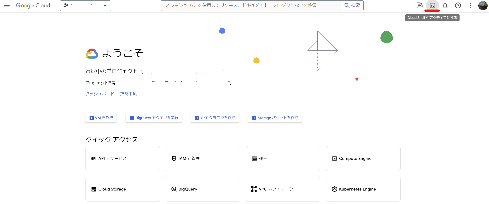

# Cloud Runハンズオン

このハンズオンではNginxをWebサーバーとしたVue.jsのフロントエンドアプリケーションをCloud Runに実装します。

## Cloud Runとは

- コンテナアプリケーションを実行可能なサーバレス環境
  - サーバレスはサーバーが無いわけではなく、サーバー（やインフラを気にする・メンテするストレスが）レス
- とりあえずCloud Run使えれば、何かしらクラウド上で動くアプリケーションを作ることができる
- サーバレスの経済学という話が面白い
  - サーバレス技術によって、APIや関数の価値を算出できるようになった
    - 課金体系がメモリやCPU利用量に対する従量課金のため、関数を1回実行したときの金額を計算可能
  - https://cloud.google.com/blog/topics/perspectives/rethinking-commercial-software-delivery-with-cloud-spanner-and-serverless?hl=en

## 利用する技術周り

- アプリケーション
  - Vue.js (Vue3)
  - Nginx
  - Docker
- Google Cloud
  - Cloud Shell
  - Cloud Run
  - Cloud Build
  - Artifact Registry

## 手順

### ターミナル立ち上げ

- Cloud ShellはGoogle Cloud環境を操作するのに特化したLinuxベースのターミナル環境
- Linuxコマンドでの操作がメインとなります
- ついでにLinuxコマンドも一部学びましょう



- 右上のCloud Shellアイコンをクリックすると立ち上がる


以下を打ち込み、実行する。

```shell
# 自分のアカウント情報の認証を行い、現在の設定を確認する。
gcloud config list
# 以下の情報が表示されるはず
# [accessibility]
# screen_reader = True
# [component_manager]
# disable_update_check = True
# [compute]
# gce_metadata_read_timeout_sec = 30
# [core]
# account = <YOUR_EMAIL_ADDRESS>
# disable_usage_reporting = True
# project = <YOUR_PROJECT_ID>
# [metrics]
# environment = devshell

# project がtigじゃない場合は以下を実行する
gcloud config set project PLEASE_ENTER_YOUR_PROJECT_ID

# 本リポジトリをCloneしてくる
git clone https://github.com/bigface0202/cloudrun-handson.git
# ディレクトリの移動:cd (change directoryの略称)
cd cloudrun-handson

# 実はマークダウンをGoogle Cloudコンソール上に表示可能
teachme README.md

# ディレクトリの中身を表示:ls（listの略称）
ls 
# 以下の情報が表示されるはず
## app  images  README.md
# appディレクトリにDockerfileがあることを確認
ls app/
# 以下の情報が表示されるはず
## nginx  sample-app  Dockerfile
```

- ちなみに、視覚的にディレクトリ構成を見たい場合はVSCodeライクなエディタも利用可能


- 「エディタを開く」からエディタを利用可能


### アプリケーションの構築とビルド

```shell
# よく使う変数は定義しておく
PROJECT_ID=PLEASE_ENTER_YOUR_PROJECT_ID
REGION=asia-northeast1
YOUR_NAME=PLEASE_ENTER_YOUR_NAME
# 一応、ちゃんと定義されているか確認しておく:echo（そのままecho）
echo $PROJECT_ID # tig-03が表示される
echo $REGION # asia-northeast1が表示される
echo $YOUR_NAME # 名前が表示される（PLEASE_ENTER_YOUR_NAMEは×）

# Artifact Registryを認証する
gcloud auth configure-docker ${REGION}-docker.pkg.dev

# イメージのBuildとPush（Cloud Buildを使うのでBuildとPushをまとめて実行できる）
## Build時に赤字のWarnが表示されるが今回は気にしない
gcloud builds submit --tag ${REGION}-docker.pkg.dev/${PROJECT_ID}/cloudrun-handson/sample-app-${YOUR_NAME}:1.0 app
```

- Build後にコンソールからArtifact Registryを開き、イメージが存在するかを確認する


```shell
# コマンドでも確認可能
gcloud artifacts docker images list ${REGION}-docker.pkg.dev/${PROJECT_ID}/cloudrun-handson
```

### Cloud Runにデプロイする

**`--allow-unauthenticated`でデプロイしているため、ハンズオンが終わったらアプリを消してください**

```shell
# デプロイはワンコマンド
gcloud run deploy ${YOUR_NAME}-app  --image ${REGION}-docker.pkg.dev/${PROJECT_ID}/cloudrun-handson/sample-app-${YOUR_NAME}:1.0 --platform=managed --project=${PROJECT_ID} --region ${REGION} --allow-unauthenticated
# 以下が表示される
## Deploying container to Cloud Run service [kishi-app] in project [tig-03] region [asia-northeast1]
##  OK Deploying... Done.                                                                                                                            
##  OK Creating Revision...                                                                                                                        
##  OK Routing traffic...                                                                                                                          
##  OK Setting IAM Policy...                                                                                                                       
## Done.                                                                                                                                            
## Service [kishi-app] revision [kishi-app-00004-hpd] has been deployed and is serving 100 percent of traffic.
## Service URL: 
```

- 表示されたService URLをクリックして画面が表示されたらOK


### 後片付け

```shell
# Cloud Runを消す
gcloud run services delete ${YOUR_NAME}-app --region=${REGION}
```

### 備考

- APIとかを実装したい場合は`--no-allow-unauthenticated`でデプロイして、Cloud Run実行権限を持つアプリのみから実行させるなどを行う
  - Cloud Runで利用したCPU/メモリの使用量に応じて課金されるため、`--allow-unauthenticated`でAPI公開したりすると、DDoSなど悪意あるアクセスを受けて課金額に泣くことになる
  - フロントエンドのアプリケーションとかは`--allow-unauthenticated`になる気がする
    - Cloud Armorでアクセス制限するなどセキュアな状態を保っておく
    - ちなみにzennはCloud Runで動いているらしい
  