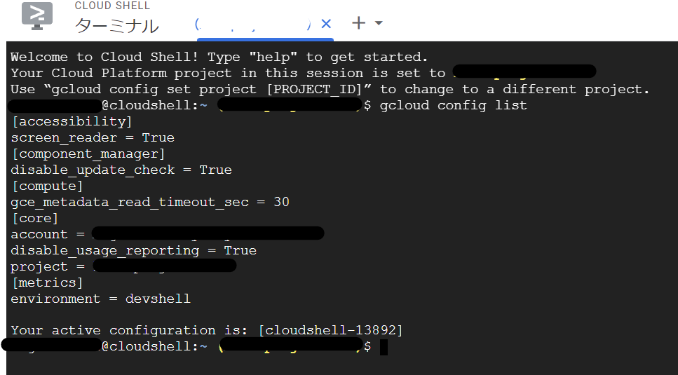

# Cloud Runハンズオン

このハンズオンではNginxをWebサーバーとしたVue.jsのフロントエンドアプリケーションをCloud Runに実装します。

## 利用する技術周り

- アプリケーション
  - Vue.js (Vue3)
  - Nginx
  - Docker
- Google Cloud
  - Cloud Shell
  - Cloud Run
  - Cloud Build
  - Artifact Registry

## 手順

### ターミナル立ち上げ

- Cloud ShellはGoogle Cloud環境を操作するのに特化したLinuxベースのターミナル環境
- Linuxコマンドでの操作がメインとなります
- ついでにLinuxコマンドも一部学びましょう


- 右上のCloud Shellアイコンをクリックすると立ち上がる



以下を打ち込み、実行する。

```shell
# 自分のアカウント情報の認証を行い、現在の設定を確認する。
gcloud config list
# 以下の情報が表示されるはず
# [accessibility]
# screen_reader = True
# [component_manager]
# disable_update_check = True
# [compute]
# gce_metadata_read_timeout_sec = 30
# [core]
# account = <YOUR_EMAIL_ADDRESS>
# disable_usage_reporting = True
# project = <YOUR_PROJECT_ID>
# [metrics]
# environment = devshell

# project がtigじゃない場合は以下を実行する
gcloud config set project tig-03
```

### アプリケーションの構築とビルド

```shell
# 本リポジトリをCloneしてくる
git clone https://github.com/bigface0202/cloudrun-handson.git
# ディレクトリの移動:cd (change directoryの略称)
cd cloudrun-handson
# ディレクトリの中身を表示:ls（listの略称）
ls 
# 以下の情報が表示されるはず
# app  images  README.md
# appディレクトリにDockerfileがあることを確認
ls app/
# 以下の情報が表示されるはず
# nginx  sample-app  Dockerfile
# イメージの名前を分けるために、変数YOUR_NAMEを登録しておく
YOUR_NAME=PLEASE_ENTER_YOUR_NAME
# YOUR_NAME=kishiみたいな
# Artifact Registryを認証する
gcloud auth configure-docker asia-northeast1-docker.pkg.dev
# イメージのBuildとPush
gcloud builds submit --tag asia-northeast1-docker.pkg.dev/tig03/cloudrun-handson/sample-app-${YOUR_NAME}:1.0 app

